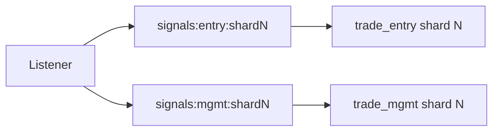
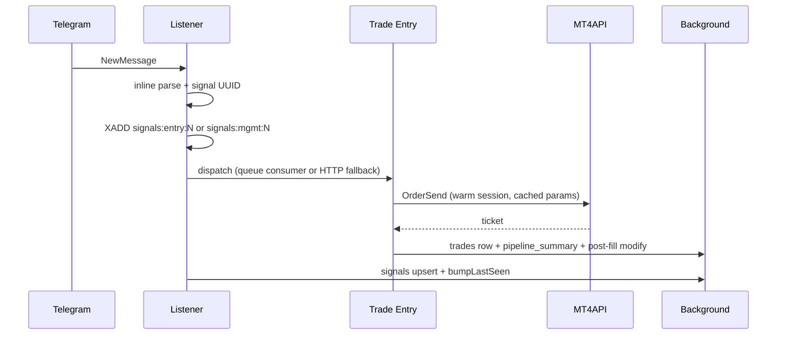

# Worker deployment (Railway / Docker)

## Hard rule: one MTProto connection per Telegram session

Telegram allows **exactly one** active connection per `telegram_sessions` auth key. Running two replicas (or overlapping deploys) with the same session causes `AUTH_KEY_DUPLICATED`, message gaps, and missed copier trades.

| Service type | Replicas | Scale lever |
|--------------|----------|-------------|
| `listener-shard-*` | **1** per shard | Add shard services (`WORKER_SHARD_ID` / `WORKER_SHARD_COUNT`) |
| `trade-entry-shard-*` | **1** per shard index | Add trade shards (`WORKER_SHARD_ID` + matching `TRADE_WORKER_SHARD_URLS` on listener) |
| `trade-mgmt-shard-*` | **1** per shard index | Same hash partition as trade entry |
| `backtest-worker` | 0–2 | Bursty history sync only |
| Monolith (`WORKER_ROLE=all`) | **1** | Early commercial only |

## Railway services (recommended split)

Use the **same Docker image** with different env per service:

### 1. Listener (`WORKER_ROLE=listener`)

```env
WORKER_ROLE=listener
WORKER_SHARD_ID=0
WORKER_SHARD_COUNT=1
WORKER_INTERNAL_TOKEN=<same secret as trade workers>
TRADE_WORKER_URL=https://your-trade-entry.up.railway.app
TRADE_MGMT_WORKER_URL=https://your-trade-mgmt.up.railway.app
# Optional: N trade entry shards (comma-separated, index = WORKER_SHARD_ID)
# TRADE_WORKER_SHARD_URLS=https://trade-shard-0.up.railway.app,https://trade-shard-1.up.railway.app
# TRADE_WORKER_SHARD_COUNT=2
# TRADE_SIGNAL_PUSH_MAX_ATTEMPTS=3
# TRADE_SIGNAL_PUSH_RETRY_BASE_MS=75
TELEGRAM_SHUTDOWN_DRAIN_MS=8000
WORKER_HEALTH_STALE_MS=180000
WORKER_LEASE_RENEW_INTERVAL_MS=20000
WORKER_SESSION_LEASE_TTL_MS=45000
```

- **Replicas:** min=1, max=1 (never scale this service horizontally for the same shard).
- **Health check:** `GET /health` on `WORKER_PORT` (default 8080).
- **Does not** run trade monitors or backtest sync on the live client.
- **Inline parse** in-process (default `LISTENER_INLINE_PARSE=true`); edge `parse-signal` is fallback only when inline is off. After parse, pushes to trade workers via `POST /internal/dispatch-signal` **before** background `signals` upsert (Realtime remains fallback).

### 2. Trade entry (`WORKER_ROLE=trade_entry`) — recommended for latency

```env
WORKER_ROLE=trade_entry
WORKER_SHARD_ID=0
WORKER_SHARD_COUNT=1
WORKER_REQUIRE_TELEGRAM_LIVE_FOR_TRADES=true
WORKER_INTERNAL_TOKEN=<shared secret>
EXECUTOR_REALTIME_SIGNALS=false
EXECUTION_ENGINE=v2
FXSOCKET_API_KEY=fxs_live_...
```

- **Replicas:** one process per **shard index** (`WORKER_SHARD_ID=0..N-1`). Do not run two containers with the same shard id.
- Executes **buy/sell** only; listener HTTP push is primary, idle-aware sweep is fallback.
- Monitors: virtual pending, CWE close, partial TP, signal entry pending, broker heartbeat (shard-scoped).
- **Health:** `GET /health`; **dispatch:** `POST /internal/dispatch-signal` with `x-internal-token`.

### 3. Trade management (`WORKER_ROLE=trade_mgmt`) — optional split

```env
WORKER_ROLE=trade_mgmt
WORKER_SHARD_ID=0
WORKER_SHARD_COUNT=1
WORKER_INTERNAL_TOKEN=<shared secret>
EXECUTOR_REALTIME_SIGNALS=false
EXECUTION_ENGINE=v2
FXSOCKET_API_KEY=fxs_live_...
# Optional: v2 reconcile tick (default 4000ms)
# V2_RECONCILE_TICK_MS=4000
```

- Same sharding env as trade entry — each mgmt shard handles management for its user partition.
- Handles **close / modify / breakeven / close worse entries**, etc.
- With `EXECUTION_ENGINE=v2`, the **v2 reconcile monitor** owns background SL/TP convergence; the v1 basket reconcile job skips v2 brokers.
- Monitors: v2 reconcile (when enabled), basket SL/TP reconcile (v1 brokers only), auto-management, trailing stop, news filter.

### 4. Trade combined (`WORKER_ROLE=trade`)

```env
WORKER_ROLE=trade
WORKER_REQUIRE_TELEGRAM_LIVE_FOR_TRADES=true
EXECUTION_ENGINE=v2
FXSOCKET_API_KEY=fxs_live_...
```

- Same as running `trade_entry` + `trade_mgmt` in one process (all monitors, all actions).
- Use when you do not want a separate management fleet yet.

### Light config cache (staging only)

Trade workers include a disabled-by-default in-memory cache for stable
`broker_channel_trading_configs` reads in the pre-broker dispatch path. The same
code artifact may be deployed to staging and production, but production must keep
the cache off until staging evidence is reviewed.

```env
LIGHT_CONFIG_CACHE_ENABLED=false
LIGHT_CONFIG_CACHE_TTL_MS=5000
LIGHT_CONFIG_CACHE_MAX_ENTRIES=1000
```

Staging enablement requires both:

```env
LIGHT_CONFIG_CACHE_ENABLED=true
LIGHT_CONFIG_CACHE_TTL_MS=5000
LIGHT_CONFIG_CACHE_MAX_ENTRIES=1000
```

Rollback is immediate and code-free: set `LIGHT_CONFIG_CACHE_ENABLED=false`.
No migration rollback, DB cleanup, cache cleanup job, or claim cleanup is needed.
Restart/redeploy only if Railway requires it to apply env changes.

The cache does not store or replace durable claims, idempotency, broker order
state, broker connectivity, prices, open orders, balance/equity/margin, kill
switches, cancellation state, listener health ownership, or any proof that a
trade was already sent. Realtime changes on `broker_channel_trading_configs`
invalidate the affected broker+channel entry; the 5s TTL bounds staleness if
realtime delivery is unavailable. Cache entries are capped per worker and stale
in-flight fills are discarded after invalidation so old settings cannot
repopulate the cache with a fresh TTL. See
[`docs/light-config-cache.md`](light-config-cache.md) for the invariants,
metrics, success criteria, and staging checklist.

Production rollout for this cache:

1. Deploy with `LIGHT_CONFIG_CACHE_ENABLED=false` and verify legacy dispatch health.
2. After staging approval, enable by env only with the reviewed TTL/max-entry values.
3. Watch hit rate, fallback, error, invalidation, stale-fill discard, pre-broker latency, duplicate trade count, and support incidents.
4. Disable immediately with `LIGHT_CONFIG_CACHE_ENABLED=false` at any cache-attributed anomaly.

### 5. Backtest (`WORKER_ROLE=backtest`)

```env
WORKER_ROLE=backtest
```

- Point Supabase Edge `BACKTEST_WORKER_URL` at this service (falls back to `WORKER_URL`).
- Ephemeral Telegram client per sync; acquires an `mtproto_hold` so the listener shard releases the auth key first (never two concurrent connections).

### Monolith (default)

```env
WORKER_ROLE=all
```

Single replica on Railway until you split services.

## Deploy overlap

On deploy, old and new containers may briefly share an auth key. Mitigations:

1. `TELEGRAM_SHUTDOWN_DRAIN_MS=8000` (or higher) on SIGTERM before exit.
2. Railway: single replica per listener shard; avoid blue/green with two live listeners.
3. Monitor `/health` → `detail[].last_event_at` per user.

## Health endpoint

`GET /health` (no auth) returns:

- `ok` — listeners connected, `last_event_at` within `WORKER_HEALTH_STALE_MS` (default 180s), **and** every connected listener has a fresh DB lease (`lease_mismatch` is false).
- `role`, `shard`, `instance`, `metrics`, `active_leases`.
- `connected_listeners` — MTProto connections on this pod.
- `fresh_leases_for_connected` — how many of those users have `worker_session_leases.expires_at > now()`.
- `lease_mismatch` / `lease_gap` — **alert when true or &gt; 0** (listener ingesting but trade workers will block copies).
- `lease_mismatch_user_ids` — user ids missing a fresh lease (when mismatch).
- `metrics.dispatch_skipped_listener_not_live` — counter when trade executor skips due to stale lease (page on sustained increase).

Use external uptime checks on listener `/health` with `ok === true` for production paging.

## User Copier Health

The dashboard reads `public.copier_listener_health` for user-facing copier status. This separates Telegram account linkage, listener connectivity, worker ownership, signal-processing readiness, and copier engine state. A fresh `worker_session_leases` row is ownership evidence only; it is not proof that the Telegram listener is connected or processing signals.

Apply migration `20260806120000_copier_listener_health.sql` before relying on the new UI. The migration is additive, requires no backfill, and missing rows display unknown/checking until a worker transition or bounded probe write occurs. Workers write with the service role through `upsert_copier_listener_health(...)`; authenticated users can read only their own safe health row and cannot write health fields. The RPC compares the current `worker_session_leases` owner with the worker id and ownership epoch before accepting owned-listener health, so a stale worker cannot overwrite a newer owner's row.

`COPIER_HEALTH_OFFLINE_GRACE_MS` defaults to `60000`. The worker persists a freshness threshold derived from that grace period and the bounded 30s probe interval. Operational requires both a fresh `updated_at` row and a recent `last_successful_probe_at`; lease renewal alone does not refresh that probe. Within grace, recent disconnects display reconnecting/degraded. Beyond grace, disconnected or stale-probe listeners display offline. User disconnects, invalid sessions, and shutdown/paused states display stopped rather than a false incident. See [`docs/copier-health-model.md`](copier-health-model.md) for the state model, UI copy, Sentry behavior, privacy constraints, and support flow.

Deployment order for the health model:

1. Apply the additive migration, including the guarded RPC and RLS policies.
2. Deploy workers so service-role CAS writes populate `copier_listener_health`.
3. Deploy frontend code that reads the authoritative health row and freshness threshold.

Rollback is code-only: frontend can be rolled back to its previous display and workers can stop writing health without affecting leases or trading. The table and RPC may remain in place because they are additive and contain only safe status metadata.

## Sentry worker monitoring

The Node worker can emit sanitized Sentry events for final/exhausted failures:
worker crashes, startup failures, shutdown timeouts, Telegram recovery exhaustion,
channel auto-disable, queue dead letters, ambiguous broker sends, broker-success
database persistence failures, reconciliation failures, and critical system-health
outages. It is intentionally
worker-only; frontend/backoffice, Supabase Edge Functions, and the Python
Telethon listener should be added in separate PRs with runtime-specific policies.
Business/operational issues use structured `captureMessage` events through the
central helper documented in
[`docs/sentry-business-observability.md`](sentry-business-observability.md).

Sentry is disabled unless both are true:

```env
SENTRY_ENABLED=true
SENTRY_DSN=<your-worker-sentry-dsn>
```

Recommended staging setup:

```env
SENTRY_ENABLED=true
SENTRY_ENVIRONMENT=staging
SENTRY_TRACES_SAMPLE_RATE=0
```

Recommended production setup:

```env
SENTRY_ENABLED=true
SENTRY_ENVIRONMENT=production
SENTRY_TRACES_SAMPLE_RATE=0
SENTRY_BUSINESS_EVENTS_ENABLED=true
SENTRY_BUSINESS_EVENT_COOLDOWN_MS=300000
SENTRY_CRITICAL_HEALTH_ENABLED=true
SENTRY_CRITICAL_HEALTH_COOLDOWN_MS=300000
FXSOCKET_SOCKET_OUTAGE_GRACE_MS=60000
```

`SENTRY_RELEASE` may be set explicitly. If omitted, the worker uses Railway commit
or deployment identifiers when present, falling back to `WORKER_BUILD_TAG`.

Sentry Logs: the SDK logs pipeline is enabled (`enableLogs`). Structured logs are
sent only through the sanitized `captureWorkerLog` helper (or the structured
`logger` in `worker/src/logger.ts`, which forwards through it). Logs carry
`subsystem`, `operation`, `error_code`, and the worker-role/shard attributes, so
they can be queried, filtered, grouped, and used in alerts/dashboards. Volume is
controlled with `SENTRY_LOGS_MIN_LEVEL=info|warn|error` (default `info`); set
`warn` to lower cost and noise. The startup log (`operation=startup`) is emitted
by every worker process, so an enabled worker proves connectivity within ~5s of
boot.

Critical health: sustained runtime/dependency outages are emitted through the
central sanitized helper as `event_category=critical_health`, with bounded tags
such as `component`, `failure_class`, `severity`, `state`, and `provider`.
`FXSOCKET_SOCKET_OUTAGE_GRACE_MS` controls the browser/market-data WebSocket
outage threshold. A transient FxSocket reconnect stays log-only; a disconnect
that remains unavailable beyond the grace emits one `fx_socket` /
`sustained_outage` event in the current worker process, suppresses retry storms
during the same outage, and resets after successful reconnect. Equivalent
provider/platform/endpoint outages from separate worker processes can still each
reach Sentry; the shared fingerprint groups them into one issue.

Dead/stalled worker detection requires an external observer. Configure one
Sentry monitor slug per worker service/role to use SDK check-ins for process
liveness:

```env
SENTRY_WORKER_HEARTBEAT_MONITOR_SLUG=tscopier-worker-trade
SENTRY_WORKER_HEARTBEAT_ENABLED=true
SENTRY_WORKER_HEARTBEAT_INTERVAL_MS=60000
SENTRY_WORKER_HEARTBEAT_CHECKIN_MARGIN_MINUTES=2
```

The slug is intentionally opt-in to avoid accidental check-in volume. Use stable
non-secret slugs such as `tscopier-worker-listener` or
`tscopier-worker-trade-entry-shard-0`. Sentry missed-check-in alerting covers
process death, hard stalls, and deploy failures where the process cannot emit an
exception. It does not prove that the trade/copier pipeline is actively
processing work. Keep external uptime checks on `/health` for listener readiness
and lease mismatch paging.

Sensitive data policy: Sentry events must not contain Telegram session strings,
Telegram auth keys, Telegram API hashes, phone numbers, full emails, broker
credentials, FxSocket keys, Supabase service-role keys, Redis tokens, OpenAI
keys, authorization headers, cookies, JWTs, private keys, full Telegram message
text, full broker responses, account balances/equity, or arbitrary request
bodies. The worker redacts nested objects, arrays, Error messages/stacks/causes,
breadcrumbs, URL credentials, and sensitive query parameters before sending.

Performance policy: the worker never flushes Sentry inside Telegram message
handling, queue processing, `OrderSend`, `OrderModify`, virtual layer firing, or
broker quote/price tick paths. Capture helpers are fire-and-forget and catch their
own failures. Shutdown performs only a bounded final flush before exit.

SDK safety policy: all Sentry default integrations are disabled in this worker
PR. Events, breadcrumbs, and logs are created only through the worker's sanitized
helper functions. Automatic HTTP/fetch instrumentation, outbound trace
propagation, console capture, request/body capture, local-variable capture, SDK
process handlers, and automatic tracing are disabled. `SENTRY_TRACES_SAMPLE_RATE`
is reserved for a future reviewed tracing PR and does not enable automatic
outbound instrumentation here. Sentry logs use the SDK Logger API (not the
`consoleIntegration`), so raw console output is never forwarded; every log passes
through `safeForSentry` at capture time and again through `beforeSendLog` before
leaving the process.

Load-test behavior: `LOAD_TEST_MODE=true` disables Sentry by default even when a
DSN is present. Only isolated test Sentry environments should opt in with
`SENTRY_LOAD_TEST_ENABLED=true`.

Rollback for business events only: set `SENTRY_BUSINESS_EVENTS_ENABLED=false`
and redeploy the worker. Roll back critical health events with
`SENTRY_CRITICAL_HEALTH_ENABLED=false`; roll back worker check-ins with
`SENTRY_WORKER_HEARTBEAT_ENABLED=false` or by clearing
`SENTRY_WORKER_HEARTBEAT_MONITOR_SLUG`. Set `SENTRY_ENABLED=false` to disable all
worker Sentry events and check-ins.

**SQL drift check:** `scripts/diagnostics/listener_lease_drift.sql` — active `telegram_sessions` without a fresh lease.

**Lease timing:** keep `WORKER_LEASE_RENEW_INTERVAL_MS` (default 20s) well below `WORKER_SESSION_LEASE_TTL_MS` (default 45s). Do not gate lease renewal on channel message activity (`WORKER_HEALTH_STALE_MS` is for ingest staleness only).

## Sharding

Assign users with `shard = hash(user_id) % WORKER_SHARD_COUNT`. Each listener service sets `WORKER_SHARD_ID` to its index (0 … N-1).

**Trade workers** use the same hash: set `WORKER_SHARD_ID` / `WORKER_SHARD_COUNT` on each trade service so monitors and `TradeExecutor` only query users on that shard. On the **listener**, set `TRADE_WORKER_SHARD_URLS` to a comma-separated list of trade-entry public URLs (same order as shard ids). Listener push routes `POST /internal/dispatch-signal` to `shardUrls[hash(user_id) % N]`.

| Service | `WORKER_SHARD_ID` | `WORKER_SHARD_COUNT` | Notes |
|---------|-------------------|----------------------|-------|
| listener-shard-0 | 0 | N | `TRADE_WORKER_SHARD_URLS` lists all trade entry URLs |
| trade-entry-shard-0 | 0 | N | Monitors + executor scoped to shard 0 users |
| trade-entry-shard-1 | 1 | N | Same image, different env |

Apply migration `20260520120000_worker_session_leases.sql` before enabling split deploys.

Apply scale migrations before growth push:

- `20260521100000_security_hardening_and_indexes.sql` — hot-path indexes + RPC lockdown
- `20260521110000_trade_execution_logs_batch_prune.sql` — drops per-insert log prune trigger; worker calls `prune_all_trade_execution_logs` on a schedule
- `20260521120000_signal_queue_tables.sql` — idempotency + dead-letter tables for Redis Streams queue

## Redis Streams queue (10k-ready dispatch)

Durable listener → trade dispatch via **Upstash Redis Streams** (shard-scoped streams, at-least-once with idempotency).



### Env (listener + all trade shards)

```env
UPSTASH_REDIS_REST_URL=https://xxx.upstash.io
UPSTASH_REDIS_REST_TOKEN=your-token
# Auto-enabled when Redis URL+token are set. Set false to force HTTP-only dispatch.
TRADE_SIGNAL_QUEUE_ENABLED=true
TRADE_SIGNAL_QUEUE_MGMT_CONSUMER_BLOCK_MS=150
TRADE_SIGNAL_QUEUE_SHARD_COUNT=4
TRADE_SIGNAL_QUEUE_ENTRY_STREAM=signals:entry
TRADE_SIGNAL_QUEUE_MGMT_STREAM=signals:mgmt
# Canary: only shard 0 uses queue initially; other shards stay on HTTP push
TRADE_SIGNAL_QUEUE_CANARY_SHARDS=0
TRADE_SIGNAL_PUSH_FALLBACK_ON_QUEUE_FAIL=true
```

**Split deploy latency (listener):** management HTTP push is **awaited** so push failures are visible immediately. Tune Telegram fallback polling:

```env
TELEGRAM_SAFETY_POLL_MS=10000
TELEGRAM_FAST_POLL_MS=3000
TELEGRAM_FAST_POLL_LIVE_STALE_MS=120000
```

Trade shards also need the same Redis env + `TRADE_SIGNAL_QUEUE_ENABLED=true` + matching `WORKER_SHARD_ID` / `TRADE_SIGNAL_QUEUE_SHARD_COUNT`.

### Cutover playbook

1. **Dark launch** — Deploy code; queue auto-enables when Redis env is present (or set `TRADE_SIGNAL_QUEUE_ENABLED=false` explicitly for no change).
2. **Canary shard 0** — Set `TRADE_SIGNAL_QUEUE_CANARY_SHARDS=0`, enable queue on listener + trade-entry-shard-0 + trade-mgmt-shard-0. Keep `TRADE_SIGNAL_PUSH_FALLBACK_ON_QUEUE_FAIL=true`.
3. **Monitor** — Run queue slices in [`scripts/diagnostics/scalability_scorecard.sql`](../scripts/diagnostics/scalability_scorecard.sql) (#10–#14). Check trade `/health` → `queue[]` pending/lag.
4. **Expand** — Add shards to canary list (`0,1`, then all). When enqueue p99 and `queue_dead_letter` are stable for 24h+, set `TRADE_SIGNAL_PUSH_FALLBACK_ON_QUEUE_FAIL=false` on canaried shards.
5. **Full cutover** — Remove `TRADE_SIGNAL_QUEUE_CANARY_SHARDS`, then `TRADE_SIGNAL_PUSH_ENABLED=false` on listener (HTTP push disabled).
6. **Rollback** — Set `TRADE_SIGNAL_QUEUE_ENABLED=false` or re-enable `TRADE_SIGNAL_PUSH_ENABLED=true` immediately.

### Health / SLO guardrails

Trade worker `GET /health` includes `queue[]` per lane: `stream_length`, `pending`, `last_read_at`, `last_ack_at`.

Alert when (see scorecard #14):

- `enqueue_to_start_ms` p99 &gt; 5000
- `dispatch_enqueue_failed` &gt; 1% of attempts for 15m
- `queue_dead_letter` growth &gt; 10/hour
- `http_push_fallback` &gt; 5% while queue enabled

Dead letters persist in `signal_queue_dead_letters`; replay via `worker/src/queue/signalQueueReplay.ts` helpers.


## Scale / idle polling (Phase 1)

Worker monitors use **idle-aware backoff**: a cheap `EXISTS` probe runs first; when no pending legs / open auto-BE / trail rows exist, the monitor sleeps at the **idle** interval (default 60s) instead of polling every 1.5s. Supabase Realtime on work tables (`range_pending_legs`, `signals`, `trades`, …) **pokes** monitors awake when new work arrives (Phase 3 hybrid — safety sweep still runs on idle interval).

Tune via env (see `worker/.env.example`):

| Monitor | Active (default) | Idle (default) |
|---------|------------------|----------------|
| virtual pending / partial TP / auto-mgmt / trail / CWE / signal entry | 400ms | 15000ms |
| basket reconcile | 15000ms | 120000ms |
| executor parsed sweep | 3000ms | 15000ms |
| broker reconnect sweep | 120000ms | 300000ms |
| forced hard-reconnect sweep | 900000ms | n/a |

Broker keepalive notes:

- **Worker-side FxSocket keepalive** — `TradeExecutor.sessionHeartbeatTick` runs every `BROKER_SESSION_HEARTBEAT_MS` (default **15s**) with single-flight protection. Each tick calls `keepSessionAlive` (light `checkConnect`) for all active shard brokers and prewarms symbol list/params from each broker's `symbol_to_trade`. The old Supabase edge `broker-session-keepalive` cron was removed during the FxSocket migration; warming is trade-worker local again.
- Align `BROKER_SESSION_PING_MIN_INTERVAL_MS` with the heartbeat interval (e.g. both **10s**) so `sessionPingAt` stays fresh and `brokers_warm_at_dispatch: true` on live entries.
- `BROKER_RECONNECT_BACKOFF_MAX_MS` and `BROKER_RECONNECT_BACKOFF_RESET_MS` tune weekend/off-hours retry starvation.
- `BROKER_HARD_RECONNECT_SWEEP_MS` periodically retries errored accounts with stored credentials even when normal backoff is active.

**`connection_status`** is written only by the worker (`brokerConnectionMonitor`, session-down paths), debounced to at most once per 60s per broker when status unchanged. Edge `check` and frontend health polls are read-only for DB status (local UI state only).

**`trade_execution_logs`** retention runs every 10 minutes via worker RPC (`prune_all_trade_execution_logs`, default **500** rows per user). Set `TRADE_LOG_RETENTION_KEEP` on the worker if you need a different cap.

Expected idle DB load drop: **~60–80%** vs fixed 1.5s global polls.

## Low-latency path (split deploy)

**Target:** Telegram event → broker `OrderSend` P50 **&lt;800ms**, P99 **&lt;2s** (variance from bridge round-trip only).



1. **Inline parse** — `worker/src/parseSignal.ts` + `channelKeywordsCache` (no edge HTTP on live path).
2. **Dispatch-first** — Pre-generated `signals.id`, `POST /internal/dispatch-signal` before DB writes; listener persists in background.
3. **Entry fast path** — Live `buy`/`sell` bypass queue and heavy DB idempotency (`inflight` only); `OrderSend` first, management (opposite close, merge, channel SL/TP, pip stops) in `postFillFollowUp`.
4. **Broker pre-warm** — `EXECUTOR_PREWARM_SYMBOLS` loads symbol list/params on start and on each heartbeat tick; `BROKER_SESSION_HEARTBEAT_MS` (default **15s**, recommend **10s** in production) keeps FxSocket sessions warm via `keepSessionAlive`.
5. **No market `/Quote` on live path** — Clamp from cached `SymbolParams`; pip/channel stops applied via `OrderModify` post-fill.
6. **Concurrent queue drain** — `EXECUTOR_MAX_CONCURRENT_SIGNALS` (default **4**) for sweep/realtime/management.
7. **Lease gate cache** — `WORKER_LEASE_GATE_CACHE_MS` (default **8000**).
8. **MT HTTP pool** — `MT4API_HTTP_CONNECTIONS` (default **128**) per MT4/MT5 host; raise for burst copy at scale.
9. **Broker keepalive** — `TradeExecutor.sessionHeartbeatTick` pings cached sessions; `BrokerConnectionMonitor` handles reconnect/status only (no duplicate heartbeat loop).

**Staging sharding pilot:** see [`docs/staging-shard-fleet.md`](staging-shard-fleet.md). **Load tests:** [`scripts/load/README.md`](../scripts/load/README.md). **Latency SQL:** [`scripts/diagnostics/pipeline_latency.sql`](../scripts/diagnostics/pipeline_latency.sql).

### Diagnosing slow execution

Live entries write one consolidated row:

| `action` | Meaning |
|----------|---------|
| `pipeline_summary` | End-to-end timings (`telegram_to_listener_ms`, `parse_ms`, `dispatch_ms`, `prep_ms`, `order_send_ms`, `total_ms`) |

```sql
select
  created_at,
  request_payload->>'total_ms' as total_ms,
  request_payload->>'parse_ms' as parse_ms,
  request_payload->>'dispatch_ms' as dispatch_ms,
  request_payload->>'prep_ms' as prep_ms,
  request_payload->>'order_send_ms' as send_order_ms,
  request_payload->>'broker_send_ms' as broker_send_ms,
  request_payload->>'channel_delay_ms' as channel_delay_ms,
  request_payload->>'channel_delay_skipped' as channel_delay_skipped,
  request_payload->>'has_listener_timestamps' as has_listener_timestamps,
  request_payload->'timestamps' as timestamps
from trade_execution_logs
where signal_id = '<signal_id>'
  and action = 'pipeline_summary'
order by created_at desc
limit 1;
```

**How to read timings**

| Field | Meaning |
|-------|---------|
| `parse_ms` | Listener inline parse (`t_parse_done − t_listener_received`). `null` = trade worker never got listener stamps (redeploy listener, or signal came from sweep/realtime only). |
| `dispatch_ms` | HTTP push RTT (`t_dispatch_received − t_dispatch_sent`). |
| `prep_ms` | Trade worker before `sendOrder` (gate, keywords, broker list). |
| `order_send_ms` / `send_order_ms` | **Entire `sendOrder`** — includes channel `delay_msec`, planning, virtual-pending DB, and all leg `OrderSend` calls. |
| `broker_send_ms` | First→last broker `OrderSend` API only (after deploy with stamp fields). |
| `channel_delay_ms` | Configured Copier Engine delay; on live fast path this is **skipped** (`channel_delay_skipped: true`) so entries are not held 15s+. |
| `brokers_warm_at_dispatch` | `true` when session ping + symbol caches were fresh at signal dispatch (heartbeat + `symbol_to_trade` prewarm working). |
| `dispatch_source` | `listener_push`, `sweep`, `queue`, etc. — identifies how the signal reached the trade worker. |

Sweep/realtime/management paths still emit `dispatch_received`, `handle_start`, `handle_end`, and per-leg `order_send` rows.

Look for `parse_ms` &gt; 100 (inline parse should stay &lt;30ms), `order_send_ms` ≈ `channel_delay_ms` (delay was blocking — fixed on live fast path), large `prep_ms` / `broker_resolve_ms` with `brokers_warm_at_dispatch: false` (cold broker — check heartbeat env and `symbol_to_trade`), or rising `dispatch_push_attempt` failures (wrong `TRADE_WORKER_URL` / worker asleep).

| Symptom | Likely cause | Fix |
|---------|--------------|-----|
| `brokers_warm_at_dispatch: false`, high `broker_resolve_ms` | Heartbeat disabled/stale or missing `symbol_to_trade` | Set `BROKER_SESSION_HEARTBEAT_MS=10000`, `EXECUTOR_PREWARM_SYMBOLS=true`, list traded symbols in broker settings |
| High `dispatch_ms`, `dispatch_source: listener_push` | Listener → trade HTTP slow or worker cold | Verify `TRADE_WORKER_URL`, no scale-to-zero on trade entry |
| `dispatch_push_attempt` failures | Push URL/token mismatch | Fix shard URL env; check listener logs |
| `order_send_ms` ≈ `channel_delay_ms` | Channel delay blocking | Set channel `delay_msec` = 0; confirm `channel_delay_skipped: true` on live entries |
| High `parse_ms` or missing listener timestamps | Listener not stamping pipeline | Redeploy listener; signals via sweep only |

### Range pending legs (duplicate opens)

The worker monitor (`virtualPendingMonitor`, 1.5s) is the primary firer; **`range-pending-sweep`** (Supabase cron, ~60s) only picks up rows the worker missed for 45s+.

### Layering modes foundation

Manual settings now distinguish two independent concepts:

| Setting | Meaning |
|---------|---------|
| `layering_mode` | Product algorithm: `legacy`, `static`, or `dynamic`. |
| `range_layering_type` | Execution mechanism: virtual market fire (`auto`) or broker-native pending order (`pending_order`). |

Phase A is foundation only. `layering_mode=legacy` preserves the current
production behavior exactly: range percent reserves split legs, `range_step_pips`
sets rung spacing, and `range_distance_pips` caps depth. Missing or invalid mode
values normalize to `legacy`, so existing accounts and old pending baskets remain
on their original behavior.

Future `static` behavior will use a fixed total layer count, including the first
entry. Future `dynamic` behavior will use the actual first broker fill as the
anchor, a preferred pip step, and a maximum total layer count. Those calculators
and execution writes are not implemented in Phase A.

`range_pending_legs.layer_plan_id` and `range_pending_legs.layer_plan_metadata`
are nullable plan-foundation fields for future immutable plans. Null values mean
legacy. Future static/dynamic rows should store a complete snapshot so restart
recovery does not depend on current account settings.

Phase A deployment order: either the code or the migration can be deployed first
because the runtime does not explicitly query or write `layer_plan_id` or
`layer_plan_metadata` yet. The migration is additive and nullable, requires no
backfill, and old rows continue to resolve as legacy. Rolling back Phase A code
does not require removing the nullable columns.

Phase C execution integration will require this migration to be applied before
Static/Dynamic execution is enabled. Keep `LAYERING_MODES_EXECUTION_ENABLED=false`
until the required schema, calculators, immutable plan writes, and execution
guards are deployed together.

This future integration flag is present for rollout planning, but Phase A still
rejects `static`/`dynamic` execution because the calculators and immutable plan
creation are not implemented yet:

```env
LAYERING_MODES_EXECUTION_ENABLED=false
```

Legacy range execution continues normally. Static/dynamic settings may round-trip
through settings storage, but worker planning rejects range execution for those
modes instead of silently falling through to legacy semantics. The warning only
contains the normalized mode, not raw signal, account, or broker data.

Phase C adds `layering_plans` for immutable, non-executable prepared Static and
Dynamic plan snapshots. The Phase C migration is additive and may be deployed
before or after the Phase C code because no runtime path activates those plans or
materializes executable `range_pending_legs`. Prepared plans are inert until a
future Phase D explicitly activates/materializes funded prices. Keep
`LAYERING_MODES_EXECUTION_ENABLED=false`; enabling it in Phase C still does not
make Static/Dynamic execution operational.

`layering_plans` is worker/service-role only: RLS is enabled, `anon` and
`authenticated` table privileges are revoked, and no frontend/client policy reads
plan metadata. Persistence compares a semantic fingerprint that excludes
lifecycle timestamps, so retry-after-timeout can return the original prepared
plan without overwriting immutable metadata. Recovery is status-aware:
`prepared` and read-only `active` rows can be parsed, while `completed`,
`cancelled`, `invalid`, and unknown statuses fail closed for Phase C.

### Static/Dynamic layering final rollout

The final integration adds guarded Static/Dynamic preparation, CAS activation,
and virtual pending materialization from immutable `fundedPrices`/`lots`.
Existing accounts remain `layering_mode=legacy` unless explicitly changed.
Legacy execution, `range_layering_type`, Telegram parsing, queues, and broker
send paths remain unchanged for Legacy rows.

Static/Dynamic are disabled by default and require all gates:

```env
LAYERING_MODES_EXECUTION_ENABLED=true
LAYERING_STATIC_EXECUTION_ENABLED=true
LAYERING_DYNAMIC_EXECUTION_ENABLED=true
LAYERING_MODES_ACCOUNT_ALLOWLIST=<broker-account-id>
LAYERING_MODES_PREPARE_ONLY=false
LAYERING_MODES_KILL_SWITCH=false
```

Default-safe values:

```env
LAYERING_MODES_EXECUTION_ENABLED=false
LAYERING_STATIC_EXECUTION_ENABLED=false
LAYERING_DYNAMIC_EXECUTION_ENABLED=false
LAYERING_MODES_ACCOUNT_ALLOWLIST=
LAYERING_MODES_PREPARE_ONLY=true
LAYERING_MODES_KILL_SWITCH=true
```

Empty allowlist enables no Static/Dynamic accounts. Wildcards are not supported.
The kill switch blocks activation and pre-send execution for Static/Dynamic but
does not change Legacy behavior.

Rollout sequence:

1. Apply the nullable `range_pending_legs` plan-column migration.
2. Apply the `layering_plans`/`activate_layering_plan` migration.
3. Deploy worker/frontend code with all Static/Dynamic gates disabled.
4. Verify Legacy copier behavior.
5. Enable prepare-only for one staging account; confirm prepared plans and no
   active pending legs.
6. Disable prepare-only only for one staging account; verify activation, restart
   recovery, duplicate-worker races, kill switch, cancellation, and native
   pending-order reconciliation where supported.
7. Verify the account settings capability response and selector show
   Static/Dynamic only for the allowlisted staging account.
8. Expand the allowlist gradually.

Rollback: set `LAYERING_MODES_KILL_SWITCH=true`, disable mode flags, or clear
the allowlist. Preserve `layering_plans` and historical `range_pending_legs` for
audit and reconciliation.

Static/Dynamic broker-native `range_layering_type='pending_order'` is supported
for FxSocket MT4/MT5 accounts that pass rollout, allowlist, connection,
capability, price-distance, and lot validation. The worker places only immutable
funded plan levels after the first/immediate layer and stores deterministic
broker references on `range_pending_legs`. Unsupported adapters fail closed;
Legacy broker-pending behavior remains unchanged.

Native pending sends require durable pre-send state. The activation RPC creates
one inert row per remaining funded leg. Each broker send then CAS-claims exactly
one row to `submission_claimed`, persists the deterministic client reference and
attempt metadata, rechecks rollout/kill switch/plan fingerprint immediately
before `OrderSend`, and only then calls FxSocket. Ambiguous outcomes and DB
confirmation failures move to `reconciliation_required`. Ambiguous states are
not sendable: a matching broker reference is adopted, a conflict invalidates the
plan, and lookup misses/outages remain reconciliation/manual-review until an
operator performs an explicit audited recovery.

Worker startup and the broker-pending monitor recover native submission states
(`submission_claimed`, `submission_ambiguous`, `reconciliation_required`, and
unconfirmed submitted rows) by deterministic reference only. Recovery does not
rerun calculators, use current settings, reanchor from quotes, or fall back to
virtual/Legacy execution. Recovery ownership is leased with
`reconciliation_claimed_at` / `reconciliation_claimed_by`;
`LAYERING_NATIVE_RECOVERY_LEASE_TIMEOUT_MS` defaults to 300000ms so a crashed
recovery worker cannot permanently strand a row. Lookup outages release the
lease for later startup passes while remaining non-sendable. Broker-authoritative
lookup misses move to `manual_review` and require operator review rather than
automatic resend.

Cancellation moves Static/Dynamic plans to `cancelling`, blocks new virtual and
native claims, locally cancels unsent virtual legs, and reconciles native broker
state before any audited FxSocket cancellation call. Pending broker orders get
one cancel request; filled orders are preserved; already-cancelled/rejected
orders are adopted. Broker cancel timeouts remain `cancellation_pending` and
restart recovery continues by reconciliation without duplicate cancel requests.
Missing cancel capability or missing tickets become `cancellation_manual_review`.
Plans reach `entries_complete` only after the first immediate execution linkage
is confirmed and all remaining entry legs are terminal. The `completed` status is
reserved for product-level basket/trade terminal semantics.

Static/Dynamic first-fill activation is part of the immediate-fill lifecycle. The
live-fast path must await plan persistence and activation before reporting
success for layering entries; only unrelated non-layering follow-up work may run
in the background.

Deploy order for this integration:

1. Apply the `layering_plans` migration, including the new RPC signature,
   native submission columns, and direct-update guard triggers.
2. Deploy `layering-mode-capabilities` and `update-layering-settings` Edge
   Functions.
3. Deploy frontend and worker with all Static/Dynamic flags disabled.
4. Enable prepare-only for one allowlisted staging account, then enable virtual
   execution, then native pending on one supported FxSocket MT4/MT5 staging
   account.

Do not advertise generic broker-native support. Any broker path without
FxSocket MT4/MT5 placement, reference reconciliation, and cancellation support
must return `broker_pending_unsupported`.

The frontend must use the server-authoritative `layering-mode-capabilities`
function before showing Static/Dynamic controls. With the default flags above,
the response makes Static/Dynamic unavailable and Legacy remains selected for
existing accounts.

Staging checklist: [`docs/layering-modes-staging-runbook.md`](layering-modes-staging-runbook.md).

Guards (worker + edge sweep):

- Do not fire a `step_idx` that already has a **`fired`** row for the same `(signal_id, broker_account_id, symbol)`.
- Do not insert a new pending row for a `step_idx` that already exists (any status) — the partial unique index only blocks duplicate **active** rows, so re-plans after fire used to create a second pending rung.
- Stale `claimed` rows are reconciled (re-fire only when no `virtual_pending_fired` log exists for that leg id).
- Open trades are capped using `virtual_pending_inserted.rows` + successful `order_send` count from execution logs.

If you already have runaway duplicates, cancel orphan actives (keep one `fired` row per step):

```sql
-- Pending/claimed rows where the same step already fired
update range_pending_legs dup
set status = 'cancelled', error_message = 'manual_duplicate_cleanup'
from range_pending_legs fired
where dup.status in ('pending', 'claimed')
  and fired.status = 'fired'
  and dup.signal_id = fired.signal_id
  and dup.broker_account_id = fired.broker_account_id
  and dup.symbol = fired.symbol
  and dup.step_idx = fired.step_idx
  and dup.id <> fired.id;
```

Redeploy **Trade Entry** and **`range-pending-sweep`** after guard changes.

## Split deploy checklist (avoid duplicate trades)

| Check | Where |
|-------|--------|
| `TRADE_WORKER_URL` = **Trade Entry** public URL (https, no trailing slash) | **Listener** service only |
| `TRADE_MGMT_WORKER_URL` = **Trade Management** URL | **Listener** only |
| `TRADE_WORKER_SHARD_URLS` = comma-separated trade entry URLs (shard 0, 1, …) when using N trade shards | **Listener** only |
| Each trade service: `WORKER_SHARD_ID` matches its index in `TRADE_WORKER_SHARD_URLS`; `WORKER_SHARD_COUNT` = N | **Trade Entry / Trade Mgmt** |
| `WORKER_URL` is **not** used for copier execution (telegram-auth / backtest only) | Supabase Edge secrets |
| Old **`WORKER_ROLE=trade`** service is **stopped/deleted** — if it still runs, it duplicates Entry + Management | Railway |
| Trade Entry logs: `started mode=entry … realtime=false` | Trade Entry deploy logs |
| Multi-trade UI: **16 instant + 17 layering** = 16 market orders **at once** by design; only the 17 layer over time | Account config |
| `order_send` count per `signal_id` ≈ immediates; `virtual_pending_fired` ≈ layering steps | `trade_execution_logs` |

If `TRADE_WORKER_URL` points at a deleted service, push fails (listener warns `tradeSignalPush push failed`) and only sweep/realtime ran — fix the URL and redeploy listener.

## Channel management instructions (copier)

Management messages (`Close half`, `Close worse entries`, `Adjust SL`, etc.) are scoped as follows:

| Message type | Applies to |
|--------------|------------|
| **Reply** to a Telegram signal (`reply_to_message_id` set) | That signal’s basket only (e.g. Gold entry + SL/TP in the reply thread) |

**Close worse entries** (channel post) closes open legs on that channel whose entry is within your configured pip band of the live price, and always closes legs tagged with `cwe_close_price` (range multi-trade CWE immediates). Requires **Multi Trades** + **Close worse entries** enabled on the broker account. Redeploy **trade worker** and **parse-signal** after CWE fixes.

### Management execution speed (live Telegram)

Live management (`close_worse_entries`, `close`, `modify`, edited SL/TP) bypasses the in-process queue and uses parallel leg execution with fast close/modify on the trade-mgmt worker. Sweeps and reconcile jobs keep verified closes.

| Env | Recommendation |
|-----|----------------|
| `LISTENER_INLINE_PARSE=true` | Required (default) — avoids OpenAI parse delay before dispatch |
| `AI_MODIFICATION_PARSE_ENABLED=false` | Optional: deterministic-only if channel keywords cover your phrases |
| `AI_MODIFICATION_PARSE_TIMEOUT_MS=1500` | Lower if AI modification parse stays enabled |
| `TRADE_MGMT_WORKER_URL` | Dedicated mgmt worker URL on listener (not shared with entry) |
| `EXECUTOR_MAX_CONCURRENT_SIGNALS=6` | More parallel signal handlers on mgmt shard |
| `MGMT_LEG_CONCURRENCY=6` | Parallel CWE/SL legs per broker (max 12) |
| `TRADE_SIGNAL_QUEUE_MGMT_CONSUMER_BLOCK_MS=150` | Lower Redis mgmt consumer latency |
| `TRADE_SIGNAL_PUSH_TIMEOUT_MS=5000` | HTTP push fallback timeout for mgmt (when queue off) |

Pipeline logs include `mgmt_fast_path`, `mgmt_wall_ms`, `mgmt_legs_total`, and `mgmt_legs_parallelism` on live mgmt dispatches.

Channel **Adjust SL / TP** instructions are stored in `channel_active_trade_params` (per channel + symbol). They apply to **management**, **pending ladder legs**, and **parameter refresh** on open baskets — not to naked **buy/sell** posts with no SL/TP in the message (avoids stale levels → broker "Invalid stops"). Run migration `20260520130000_channel_active_trade_params.sql` when upgrading.

| **Channel post**, no symbol in text | All **open trades** on that Telegram channel |
| **Channel post** with symbol (`Close half on EURUSD`, `for gold`) | Open trades on that channel for that symbol only |
| **Modify SL/TP** with no symbol, multiple symbols open | Symbols where the price is plausible; if none match, the **most recently opened** symbol on the channel |

**Virtual range pendings** (`range_pending_legs`): management applies to pending ladder legs too — **Adjust SL/TP** updates their `stoploss` / `takeprofit` before they fire; **Close** deletes all pending legs in scope so they cannot trigger later.

Deploy **Trade worker** after logic changes; deploy **`parse-signal`** Edge if symbol parsing (`on` / `for`) changed.

## Telegram session persistence (one login)

TScopier stores a GramJS **StringSession** in `telegram_sessions.session_string` after you verify your phone once. The **listener worker** holds a single long-lived MTProto socket and persists session rotations every ~30 minutes. The UI never opens its own Telegram connection.

### my.telegram.org — Test vs Production

| Field | Purpose |
|-------|---------|
| **Production configuration** | Real `api_id` + `api_hash` for live Telegram. **Use these** in `TELEGRAM_API_ID` / `TELEGRAM_API_HASH` on the listener worker. |
| **Test configuration** | Separate credentials for Telegram’s **test DCs** (fake users, not production traffic). Do **not** use for TScopier. |
| **DC 2 IP addresses** | Telegram datacenter server IPs. The MTProto client picks the correct DC automatically; you do not configure these in env. |
| **Public Key** | Telegram server RSA key used during MTProto encryption handshake. Handled internally by GramJS — not an env var. |

### What disconnects a session (and what does not)

| Event | Result |
|-------|--------|
| User clicks **Disconnect** on Copier Engine | Session row deleted; **configured channels kept** |
| Transient worker/network error | Watchdog reconnects; session **not** cleared |
| `AUTH_KEY_DUPLICATED` | Two workers connected with the same session — fix replicas; listener retries |
| `AUTH_KEY_UNREGISTERED` | Telegram revoked the key (rare); session row removed; **channels kept**; user re-verifies phone |
| Supabase/worker 401 (misconfigured token) | Error shown; session **not** auto-deleted |

**Never run more than one listener replica per shard** with the same user session. See `WORKER_LEASE_*` and `docs/worker-deployment.md` hard rule above.

## Telethon listener (Python)

For users migrated off gramjs, deploy [`telegram-listener/`](../telegram-listener/README.md) as a separate Railway service:

```env
WORKER_ROLE=listener
LISTENER_ENGINE=telethon
TRADE_WORKER_URL=https://your-trade-worker.up.railway.app
```

Set `telegram_sessions.listener_engine = 'telethon'` per user (gramjs listener skips these rows). Point Supabase Edge `TELEGRAM_LISTENER_URL` at the Python service (falls back to `WORKER_URL`).

**Cutover:** stop gramjs listener for user → set `listener_engine` → verify test signal within 30s (poll backstop).

## Incident triage

See [`docs/telegram-copier-triage.md`](telegram-copier-triage.md) and `scripts/diagnostics/phase0_triage.sh`.

## Environment reference

See `worker/.env.example` for catch-up, lease, and parse tuning variables.

### Execution engine v2 (global cutover)

Set on **every trade worker** that executes or manages orders (`trade_entry`, `trade_mgmt`, or combined `trade`):

```env
EXECUTION_ENGINE=v2
FXSOCKET_API_KEY=fxs_live_...
```

Then **remove** staged-cutover variables (they are ignored when `EXECUTION_ENGINE=v2` is set, but removing them avoids confusion):

- `EXECUTION_ENGINE_V2_BROKERS`
- `EXECUTION_ENGINE_V2_USERS`

Optional tuning:

- `V2_RECONCILE_TICK_MS` — v2 background SL/TP loop interval (default **4000** ms). Omit unless you need faster convergence than 4s.

**Requirements:** `FXSOCKET_API_KEY` must be present on trade entry and trade mgmt services. Without it, v2 broker calls fail.

**Rollback:** unset `EXECUTION_ENGINE` (or set `EXECUTION_ENGINE=v1`) and redeploy — all brokers return to the legacy v1 path.

## FxSocket Brokers sandbox (`/brokers`)

The **`fxsocket-broker`** Edge function is isolated from the live copier.

- **Account linking (v1):** [api.fxsocket.com/v1/docs](https://api.fxsocket.com/v1/docs) — `POST /v1/accounts` with login/password/server; auth via `X-API-Key` only.
- **Trading (per-account):** [fxsocket.com/docs#request-builder](https://fxsocket.com/docs#request-builder) — `https://api.fxsocket.com/mt5/{account_id}/…`

The API has no CORS headers — all calls go through Edge.

Set these in **Supabase → Edge Functions → Secrets** (not worker env):

| Secret | Purpose |
|--------|---------|
| `FXSOCKET_API_KEY` | `fxs_live_…` platform key (`X-API-Key` on all FxSocket calls) — **only required secret** |
| `FXSOCKET_BASE_URL` | Optional; default `https://api.fxsocket.com` |

Deploy: `supabase functions deploy fxsocket-broker`. Apply migration `20260615190000_fxsocket_broker_accounts.sql`.

Unit tests: `deno test supabase/functions/_shared/fxsocketClient.test.ts`

